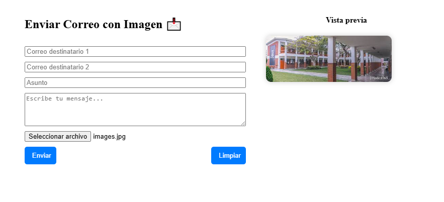

# 📩 Enviar Correo con Imagen - Google Apps Script

Este proyecto permite enviar correos electrónicos con una imagen adjunta utilizando **Google Apps Script**. El usuario puede seleccionar una imagen desde su dispositivo, visualizar una vista previa y enviar el correo a dos destinatarios con un mensaje personalizado.

## 🚀 Características

✅ Envío de correos con imagen adjunta.  
✅ Vista previa de la imagen antes del envío.  
✅ Contador de espera tras el envío.  
✅ Botón para limpiar el formulario fácilmente.  

## 📸 Captura de Pantalla



*Asegúrate de reemplazar `captura.png` con la imagen real en la carpeta del proyecto.*

## 🔧 Requisitos

- Tener acceso a **Google Apps Script** ([script.google.com](https://script.google.com/)).
- Un correo de Gmail para el envío de los mensajes.

## 🛠️ Instalación y Uso

1. **Abrir Google Apps Script**  
   - Ir a [Google Apps Script](https://script.google.com/).
   - Crear un nuevo proyecto.

2. **Copiar el Código**  
   - Copia el contenido del archivo **HTML** en un nuevo archivo `Index.html` dentro de Apps Script.
   - Agrega la función de envío en un archivo **Código.gs**.

3. **Autorizar y Ejecutar**  
   - Ejecuta el script por primera vez y autoriza el acceso a Gmail.
   - Abre el `Index.html` en el entorno de Apps Script.

## 📜 Código Principal

El código HTML principal se encuentra en `Index.html`. También se usa un script de servidor en `Código.gs` que debe contener la función `enviarCorreo`.

```javascript
function enviarCorreo(asunto, mensaje, imagenBase64, imagenNombre, destinatarios) {
  try {
    let imagenAdjunta = Utilities.newBlob(Utilities.base64Decode(imagenBase64), "image/png", imagenNombre);
    MailApp.sendEmail({
      to: destinatarios,
      subject: asunto,
      body: mensaje,
      attachments: [imagenAdjunta]
    });

    return "Correo enviado correctamente ✅";
  } catch (error) {
    return "Error al enviar el correo ❌: " + error.toString();
  }
}
```

## 📬 Contacto

Si tienes dudas o mejoras para este proyecto, siéntete libre de contribuir o contactarme.

---

✨ **¡Diviértete automatizando con Google Apps Script!** 🚀


